# Flux SDLC Platform — Vision & Problem Statement

**Date:** May 21, 2026
**Author:** Nikhil Agarwal
**Audience:** CTO, Salescode

---

## What We Are Building and Why

Salescode operates across multiple client projects, with engineering teams, delivery managers, and business analysts all working in parallel. Today, this work is scattered — across Jira boards, Slack threads, emails, spreadsheets, and verbal check-ins. There is no single place where you can answer: *"What is the state of delivery right now, across every client, every developer, every issue?"*

**Flux** is that place. It is Salescode's internal SDLC operating system — a platform that consolidates every signal from every project into one coherent view, and changes the way developers, managers, and clients experience the software delivery lifecycle.

### Everything flows into one place

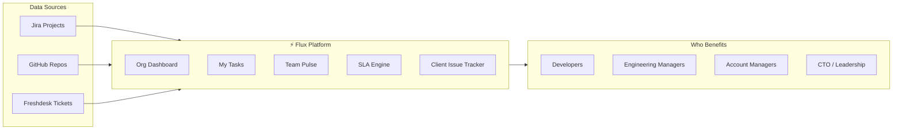

---

## Where Time Is Being Wasted Today

Before looking at solutions, this is where engineering effort leaks every single day:

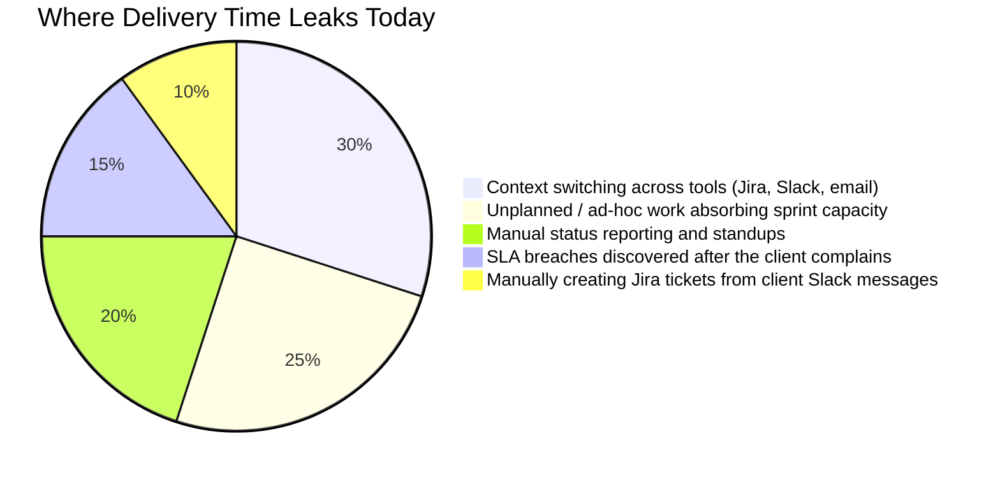

Each slice below maps to a specific problem Flux eliminates.

---

## The Problems We Are Solving

---

### For Developers

---

#### Problem 1 — No clarity on what to work on next

Developers today switch between Jira, Slack, and team standups to piece together their priorities. A typical morning looks like this:

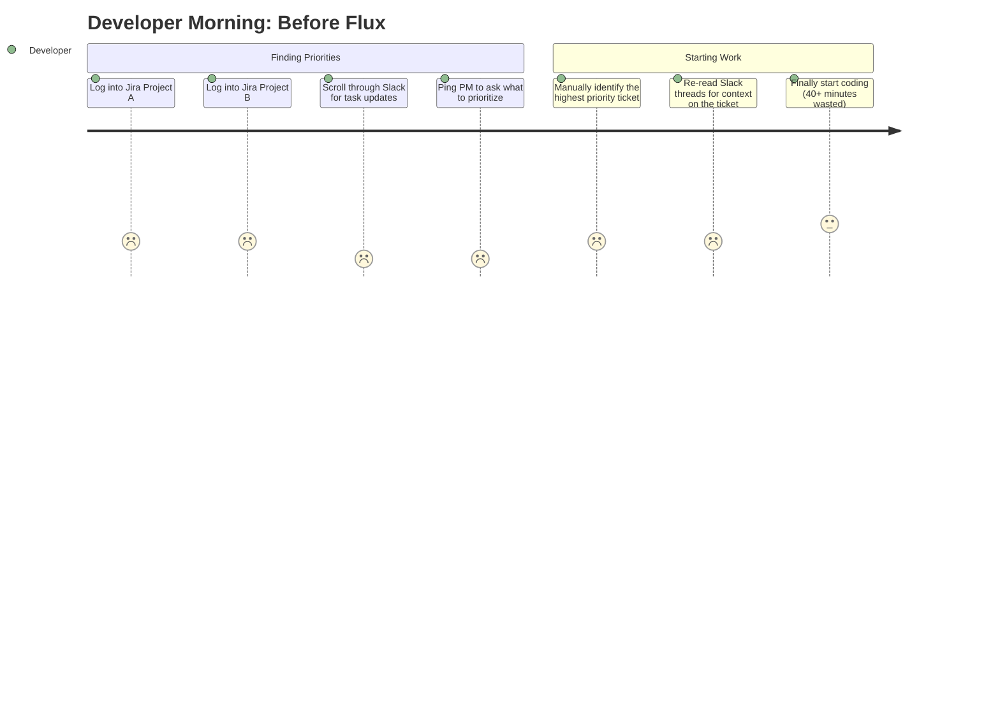

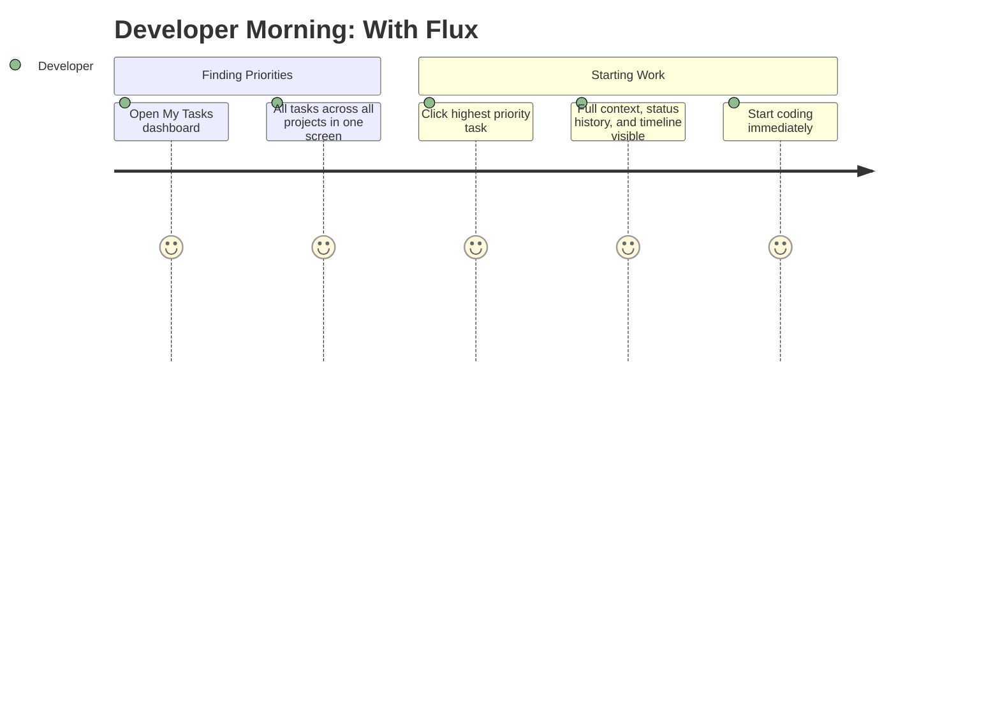

**What Flux changes:** Every developer gets a personal **My Tasks** dashboard. All their Jira issues across every project — filterable by status, priority, and project — in one place. No more hunting across boards.

---

#### Problem 2 — No visibility into where work is actually getting stuck

A ticket moves through multiple stages. Nobody knows how long it sat in each one. The same bottleneck repeats sprint after sprint because it is never visible.

**A typical issue without Flux looks like this:**

```
Status          Time Spent
─────────────────────────────────────────────────────
Todo          ██░░░░░░░░░░░░░░░░░░░░░░░  1.5h
In Progress   ████████░░░░░░░░░░░░░░░░░  6h
In Review     ██████████████████░░░░░░░  18h  ← STUCK
QA            █████░░░░░░░░░░░░░░░░░░░░  4h
Done          ─
```

18 hours in review — nobody knew until the sprint retro.

**What Flux changes:** Every issue has a **Time in Status** timeline — a visual breakdown of exactly how long that issue spent in each workflow state. Bottlenecks are visible the moment they happen, not in the retrospective.

---

### For Managers

---

#### Problem 4 — No real-time picture of team health

Knowing how a team is performing means attending standups, reading Jira manually, and pinging individuals. By the time a manager identifies a problem, it is already too late.

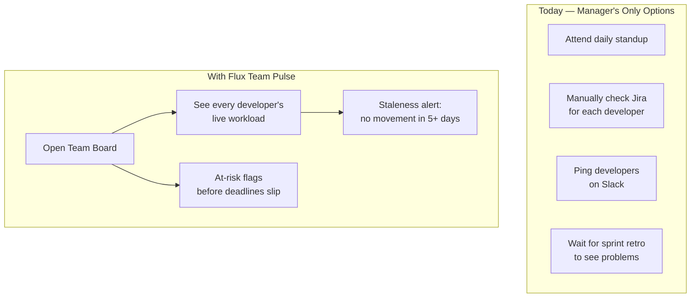

**What Flux changes:** The **Team Pulse** board gives managers a live snapshot of every developer's work — active tasks, workload distribution, and automatic staleness flags. No standup needed to answer: *"Is my team healthy right now?"*

---

#### Problem 5 — Unplanned work is invisible until it causes a slip

Developers pick up ad-hoc bugs and urgent requests that never make it into the sprint plan. Managers only find out when planned work misses the deadline.

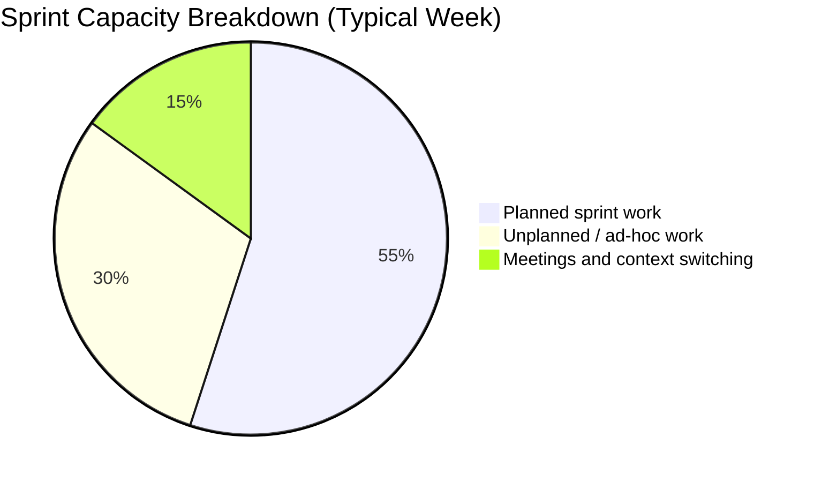

30% of capacity consumed by invisible work — every single week.

**What Flux changes:** The **Unplanned Work view** inside every team board automatically surfaces issues falling outside the planned sprint. Managers see the real capacity picture and can re-prioritize before plans slip.

---

#### Problem 6 — SLA tracking is manual and breaches are discovered too late

Salescode commits to response and resolution SLAs for every client. Today, tracking them is someone's manual job. Breaches are discovered after the client complains.

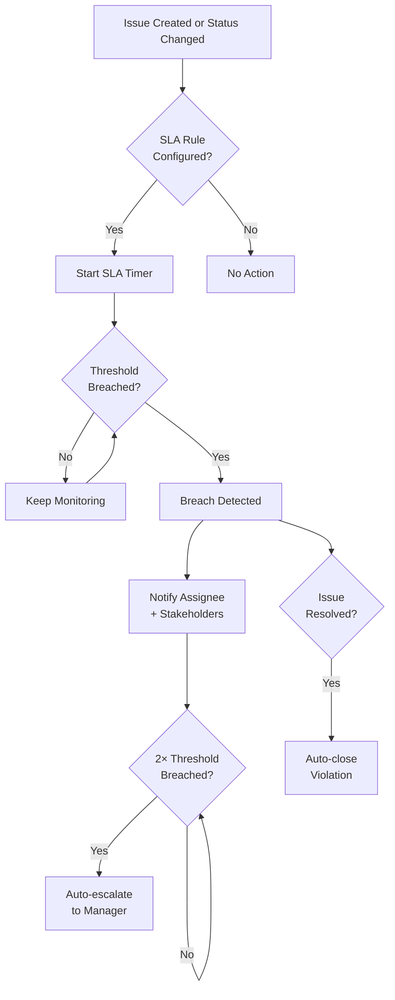

**What Flux changes:** The **SLA Engine** checks rules continuously. The moment a threshold is crossed, it notifies the right people immediately and escalates automatically at 2× — before the client even notices.

---

#### Problem 7 — Delivery velocity across all projects is invisible

There is no way to look across all active Salescode projects and understand which are on track, which are slowing down, and where effort is concentrated.

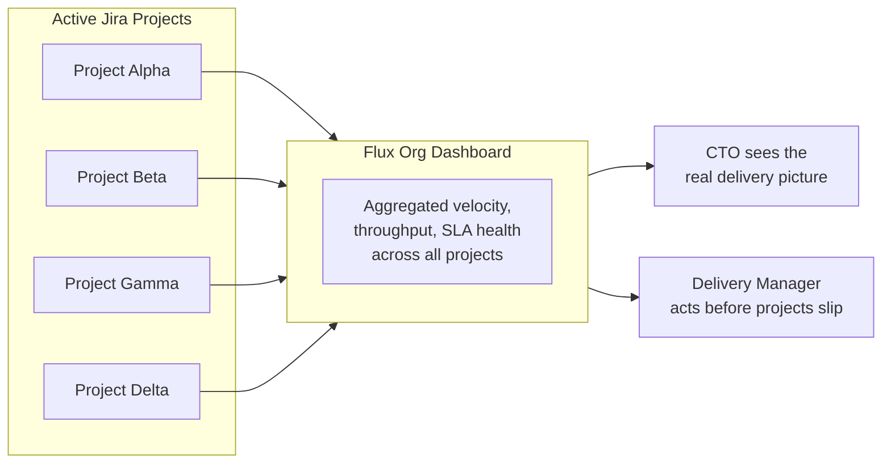

**What Flux changes:** The **Organization Dashboard** aggregates velocity, issue throughput, and SLA health across every synced Jira project — one view instead of four separate Jira boards.

---

#### Problem 8 — Developer performance reviews have no objective data

Assessing a developer relies on memory and impressions. Managers have no structured data on velocity, resolution time, or whether bandwidth is well-utilized.

| What Managers Have Today | What Developer Insights Provides |
|---|---|
| "I think they've been busy" | Exact task count in-progress vs completed |
| "They seem a bit slow this sprint" | Avg time to resolution vs team average |
| "Not sure if they're blocked" | List of issues with zero movement for 5+ days |
| "Hard to say how they're doing" | Velocity trend over the last 4 weeks |
| Gut feel in performance reviews | Data-backed conversations |

**What Flux changes:** The **Developer Insights** view gives an objective, data-driven profile per developer — making performance conversations fair and grounded.

---

#### Problem 9 — Gantt and timeline planning is always stale

Project plans live in spreadsheets. The actual work lives in Jira. These two are never in sync.

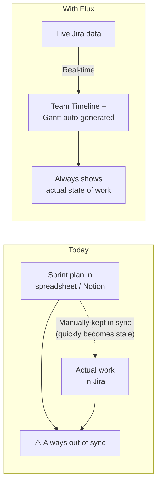

**What Flux changes:** The **Team Timeline and Gantt views** are generated directly from live Jira data. When an issue moves, the timeline updates. Managers always see the real picture.

---

### For Client Relationship Management

The existing workflow is already partially set up. Clients raise tickets in **Freshdesk**. The support team then manually links a Jira ticket to that Freshdesk ticket, embedding the FD ticket number in Jira. The relationship exists — but it is buried across two systems that nobody sees together.

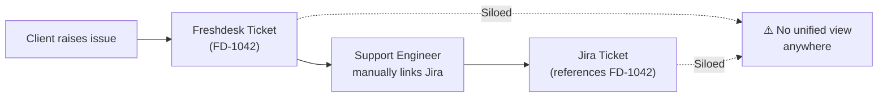

The link exists. The visibility does not. That is the problem.

---

#### Problem 10 — No single view that shows Freshdesk ticket status alongside Jira progress

To answer "what is the current status of this client's issue?" someone has to:
1. Open Freshdesk, find the ticket, read the client-facing status
2. Open Jira, search for the linked ticket by FD number, read the engineering status
3. Mentally reconcile the two

This happens for every single issue. It is slow, it requires access to both tools, and it is error-prone.

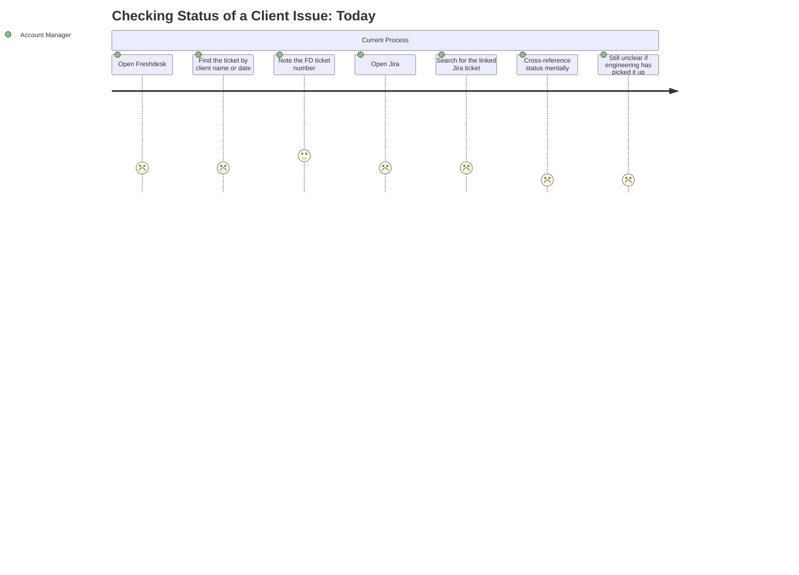

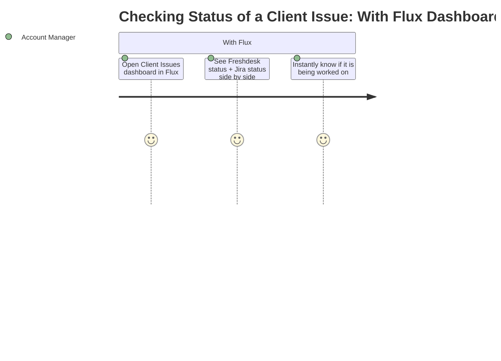

**What Flux changes:** The **Client Issues Dashboard** syncs Freshdesk tickets and their linked Jira issues into one unified view. Freshdesk status on the left. Jira progress on the right. No switching tools. No manual reconciliation.

---

#### Problem 11 — No visibility into tickets that have not been linked to Jira yet

The support team manually links the Jira ticket to Freshdesk. If they forget, or if the ticket is still being triaged, there is no Jira link yet. No one can easily see which Freshdesk tickets are still unlinked — meaning they may be sitting with no engineering action started.

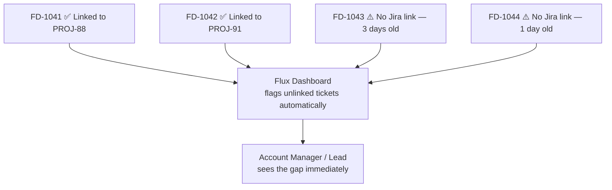

**What Flux changes:** The dashboard highlights every Freshdesk ticket that has no Jira counterpart yet, sorted by age. Nothing falls through the cracks quietly.

---

#### Problem 12 — No high-level view across all clients at once

A senior person — Account Manager, Delivery Lead, or CTO — has no single screen showing: how many open Freshdesk tickets exist across all clients, which ones have engineering work in progress in Jira, and which are at risk of breaching SLA. This picture only exists if someone manually pulls it together.

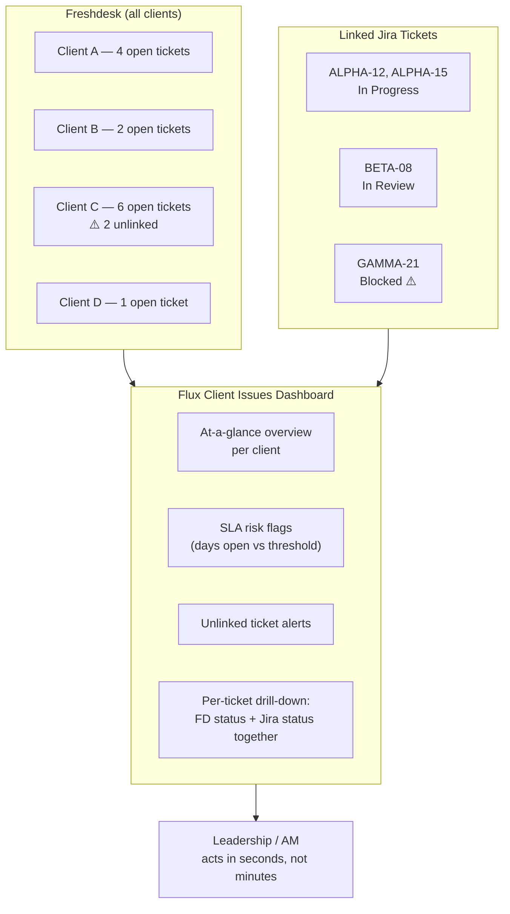

**What Flux changes:** One dashboard. Every client's Freshdesk tickets, their linked Jira issues, days open, SLA risk, and unlinked gaps — all visible in a single glance without logging into either Freshdesk or Jira.

---

#### What the dashboard card looks like per ticket

```
┌─────────────────────────────────────────────────────────────────┐
│  FD-1043  •  Client: Acme Corp  •  Priority: High  •  3d open   │
├───────────────────────────┬─────────────────────────────────────┤
│  Freshdesk Status         │  Jira Status                        │
│  ● Waiting on Support     │  PROJ-91  →  In Progress            │
├───────────────────────────┴─────────────────────────────────────┤
│  Subject: Login page throws 500 on SSO redirect                 │
│  Assignee (FD): Ravi S.   │  Assignee (Jira): Priya M.          │
│  SLA: 4h remaining ⚠️                                           │
└─────────────────────────────────────────────────────────────────┘
```

At a glance: what the client raised, where it sits in Freshdesk, where the engineering work is in Jira, who owns it on both sides, and how much SLA headroom is left.

---

## The Full Shift at a Glance

| Persona | Before Flux | With Flux |
|---|---|---|
| **Developer** | Checks 3+ Jira boards to understand priorities | One dashboard — all tasks, all projects |
| **Developer** | Blocked issues sit unnoticed until standup | Staleness alerts surface stuck work automatically |
| **Manager** | Learns about team health in retrospectives | Live team pulse — real-time workload per developer |
| **Manager** | Unplanned work is invisible until plans slip | Dedicated view shows real bandwidth consumption |
| **Manager** | SLA breaches discovered after client complains | Automated detection and escalation before it happens |
| **Manager** | No cross-project delivery view | Org dashboard — velocity and SLA health across all projects |
| **Manager** | Developer performance reviewed on gut feel | Objective delivery metrics per developer |
| **Manager** | Gantt plans always out of sync with reality | Timeline auto-generated from live Jira data |
| **Account Manager** | Checks Freshdesk and Jira separately to get one answer | Both statuses side by side in a single dashboard card |
| **Account Manager** | No visibility into unlinked tickets until a client escalates | Dashboard flags every Freshdesk ticket with no Jira link |
| **Leadership** | No consolidated view of delivery health | One platform — every project, every team, every client ticket |

---

## Who This Is For

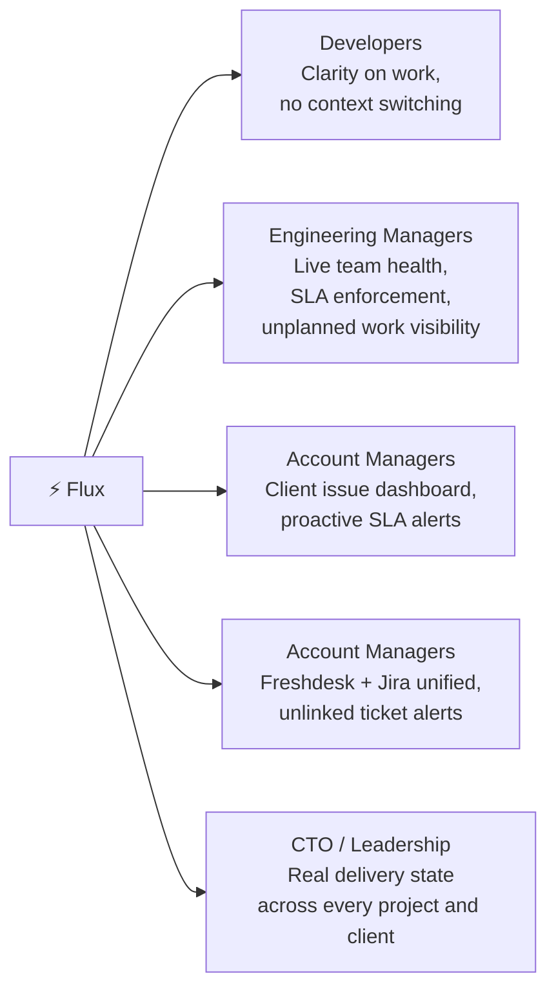

---

*For questions or feedback: Nikhil Agarwal — nikhil.agarwal@salescode.ai*
